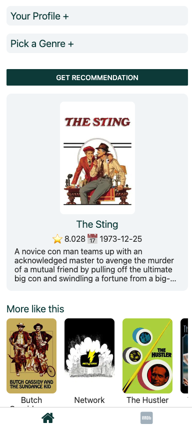
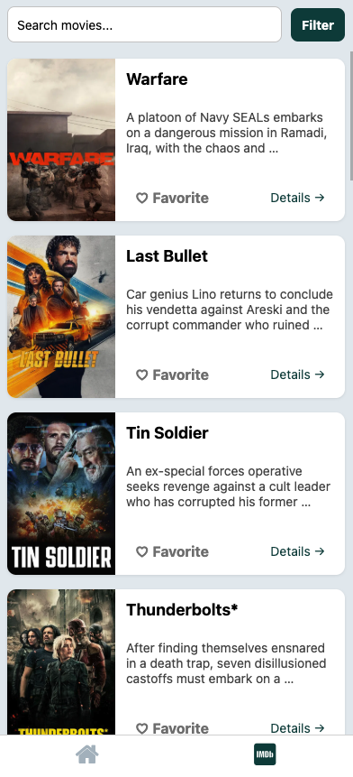
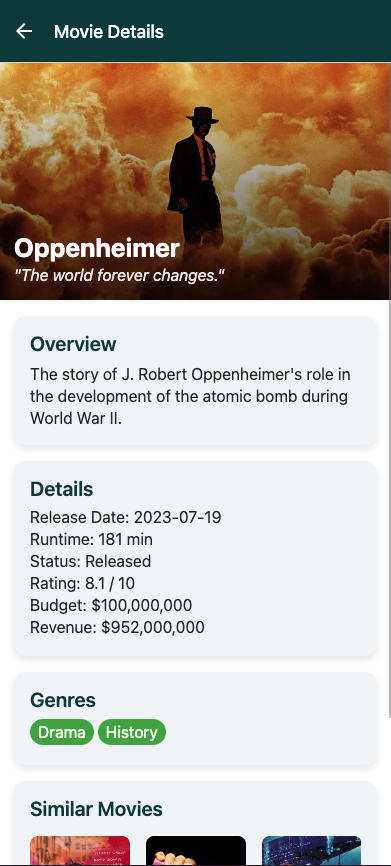

# 🎬 MovieMe — AI-Powered Movie Recommendation App

> Looking for your next movie obsession? MovieMe leverages the power of OpenAI and TMDB to deliver personalized, mood-driven movie picks—and lets you browse, search, filter and favorite all your must-see films with a smooth, animated React Native experience.

---

## ✨ Features

- **AI-Driven Recommendations**  
  Tell MovieMe your favorite movie, mood, actor or language, and GPT-3.5 will hand you a perfect match—no more endless scrolling!  

- **Search & Discover**  
  Browse the latest and greatest from TMDB, filter by genre, or search by title.  

- **Infinite Scroll & Favorites**  
  Seamlessly load more results as you scroll and star your top picks for later.  

- **Rich Movie Details**  
  Gorgeous banner, overview, runtime, budget, revenue, ratings—and even “More like this” suggestions.  

- **Snappy Animations**  
  Powered by `react-native-reanimated` for that polished, professional feel.

---

## 📸 Demo Screenshots

<p align="center">
  
  
  
</p>

---

## 🚀 Getting Started

### Prerequisites

- **Node.js** ≥ 14  
- **Expo CLI**:  
  ```bash
  npm install -g expo-cli

* **TMDB API Key** (get one at [themoviedb.org](https://www.themoviedb.org/))
* **OpenAI API Key** (get one at [platform.openai.com](https://platform.openai.com/))

### Installation

1. **Clone & Install**

   ```bash
   git clone https://github.com/ibrahimjspy/MovieMe.git
   cd movie-me
   npm install
   ```

2. **Environment Variables**
   Copy the example and fill in your keys:
   ```dotenv
   EXPO_PUBLIC_API_KEY=YOUR_TMDB_API_KEY
   EXPO_PUBLIC_OPEN_AI_API_KEY=YOUR_OPENAI_API_KEY
   ```

3. **Run in Expo**

   ```bash
   expo start
   ```

   Scan the QR code with your Expo Go app (iOS/Android) or launch on simulator/emulator.

---

## 🗂 Project Structure

```
.
├── app/
│   └── (tabs)/
│       └── two.tsx      # Browse, search, filter & favorite
│       └── index.tsx            # AI recommendation form + genre picker
├── screens/
│   └── movie/[id].tsx          # Movie details & similar titles
├── components/
│   ├── AccordionSection.tsx
│   ├── GenreTile.tsx
│   ├── LoadAnimation.tsx
│   ├── MovieCard.tsx
│   └── MoviePreview.tsx
├── constants/
│   └── app.ts                  # API keys references
├── theme/
│   └── index.ts                # Colors, spacing, typography
```

---

## 🛠 Technologies & Tools

* **React Native & Expo** with **Expo Router**
* **TypeScript** for type safety
* **TMDB API** for movie data
* **OpenAI GPT-3.5** for natural-language recommendations
* **react-native-reanimated** for smooth animations
* **Axios** for HTTP requests
* **Custom theming** (COLORS, SPACING, FONTS)

---

## 🤝 Hire Me

I built MovieMe from the ground up—UI, animations, data fetching, AI integration—so you can trust I’ll deliver polished, production-ready mobile apps. Let’s chat about your next project!

* **Email:** [ibrahimsajidjs@gmail.com](mailto:your.email@example.com)
* **LinkedIn:** [https://www.linkedin.com/in/muhammad-ibrahim-node/](https://www.linkedin.com/in/muhammad-ibrahim-node/)

---

## 📄 License

This project is open-source under the [MIT License](LICENSE).

